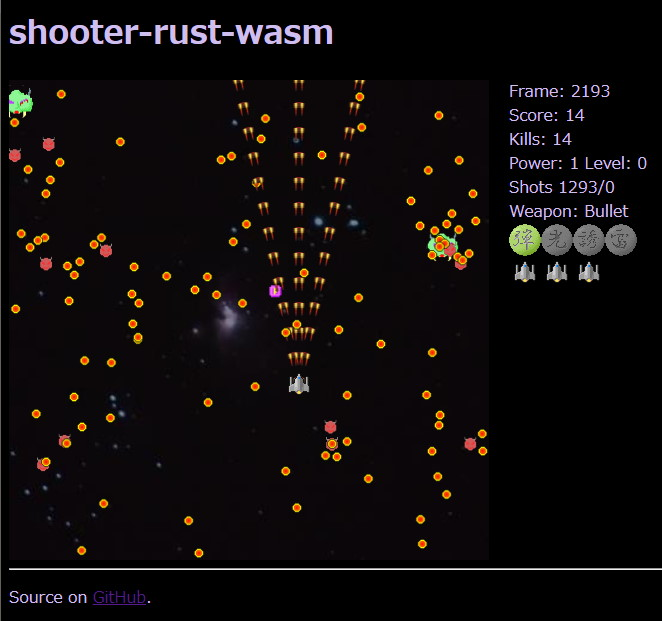
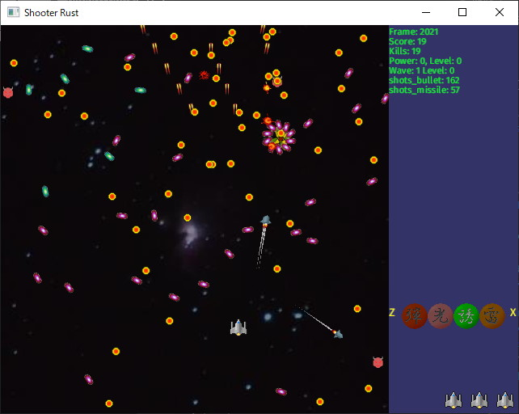

# Shooter-rust-wasm

This is a port of [shooter-rust](https://github.com/msakuta/shooter-rust) to WebAssembly.

Try it now in your browser! https://msakuta.github.io/shooter-rust-wasm/

## Screenshots




## Controls

* Arrow keys, W, A, S, D - move
* Z, X - select weapon
* Space - shoot weapon
* P - toggle pause game
* N - Restart new game


# Building web application

## Prerequisites

This game uses JavaScript and WebAssembly (Wasm), so you need a browser with WebAssembly support.
Most modern browser support it nowadays.


## How to build and run

Install

* Cargo >1.40
* npm >7.0.2

Install npm packages

    npm i

Newer Node.js versions may show this error:

```
node:internal/crypto/hash:68
  this[kHandle] = new _Hash(algorithm, xofLen);
...(omitted)...
  opensslErrorStack: [ 'error:03000086:digital envelope routines::initialization error' ],
  library: 'digital envelope routines',
  reason: 'unsupported',
  code: 'ERR_OSSL_EVP_UNSUPPORTED'
}
```

In this case, set this env variable on your shell:

```
export NODE_OPTIONS = "--openssl-legacy-provider"
```

Or like this in Windows PowerShell:

```
$env:NODE_OPTIONS = "--openssl-legacy-provider"
```

### Launch development server

    npm start

It will start webpack-dev-server, launch a browser and show http://localhost:8080 automatically.

### Launch production distribution

    npm run build

# Building native application

There is also  native application version implemented with [Piston](https://github.com/PistonDevelopers/piston) game engine
that can be compiled in a sub-crate `shooter-rust-native`.

Below is a screenshot on Windows.



Honestly I wouldn't much like to keep the native version,
because Wasm is more portable, fast to compile and even looks
faster to run.
But I will keep it anyway as an exercise making portable
application among native and the web.

It should support all platforms that Piston supports, which is basically desktops, like Windows, Linux or Mac.

## How to build and run

Install

* Cargo >1.40

Run

    cd shooter-rust-native
    cargo run --release

Note that `cargo run --release --package shooter-rust-native` won't work, because the root crate assumes
different feature set than native version.
The root crate uses "webgl" feature, which will enable wasm-bindgen and generating Wasm interface,
which is not compatible with native version.


# History

I originally wrote this game in C back in 2007 with Windows API.

About a decade later, I re-implmented it in Rust and [Piston](https://github.com/PistonDevelopers/piston).

Now finally I could bring it to the web without converting
the codebase into JavaScript or TypeScript.


# Libraries

* wasm-bindgen

I use WebGL API directly, without any graphics libraries.
